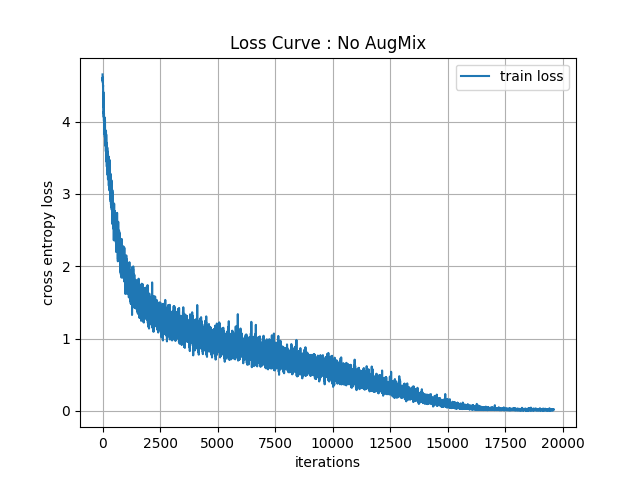
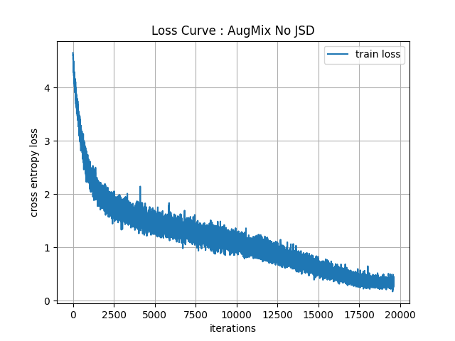
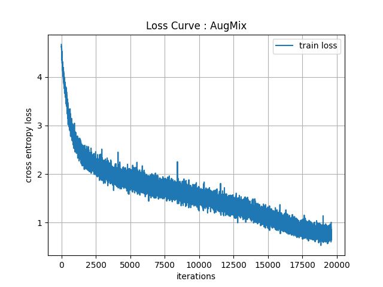

# AugMix-pytorch
Pytorch Implementation of AugMix (ICLR2020)

### Requirements
* Python 3.6 >
* PyTorch 1.4 >
* CIFAR-100, CIFAR-100-C

### Details
* Baseline : 100 epochs, 30 mins
* AugMix : 100 epochs, 100 mins
* AugmentAndMix : 100 epochs, 50.1 mins
* AugMix with 1 augmented image : 100 epochs, 49.7 mins
* AugMix with 3 augmented image : 100 epochs, 142.8 mins

### Results (Error Rate)
* Baseline : 25.72% (CIFAR-100 Test Set) / 55.02% (CIFAR-100-C Average)
* AugMix : 23.16% (CIFAR-100 Test Set) / 35.97% (CIFAR-100-C Average)
* AugmentAndMix (No JSD) : 24.62% (CIFAR-100 Test Set) / 39.65% (CIFAR-100-C Average)
* AugMix with 1 augmented image : 24.49% (CIFAR-100 Test Set) / 39.54% (CIFAR-100-C Average)
* AugMix with 3 augmented image : 23.23% (CIFAR-100 Test Set) / 36.04% (CIFAR-100-C Average)

### Loss Curves

  
   
  

### References
[1] Hendrycks, D., Mu, N., Cubuk, E. D., Zoph, B., Gilmer, J., & Lakshminarayanan, B. (2019). Augmix: A simple data processing method to improve robustness and uncertainty. arXiv preprint arXiv:1912.02781.

[2] augmix, google-research, GitHub Repository, 2020, https://github.com/google-research/augmix
